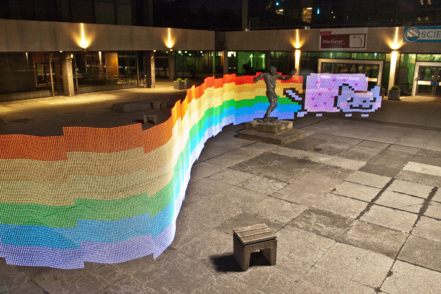
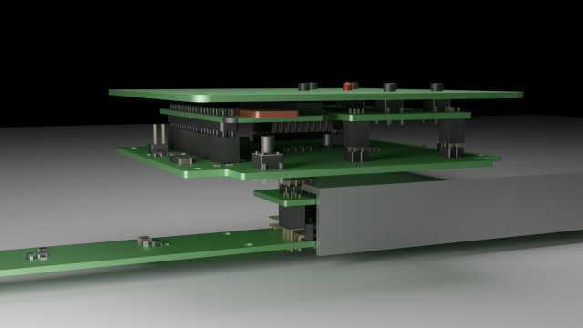
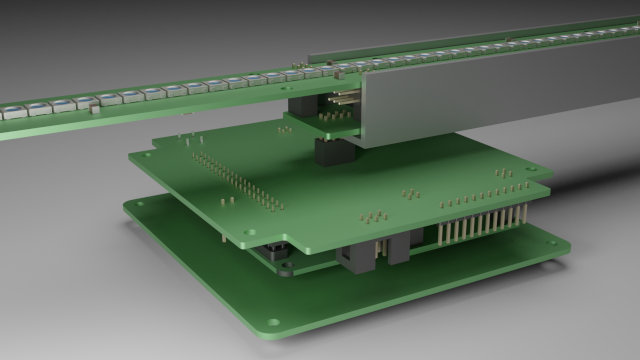
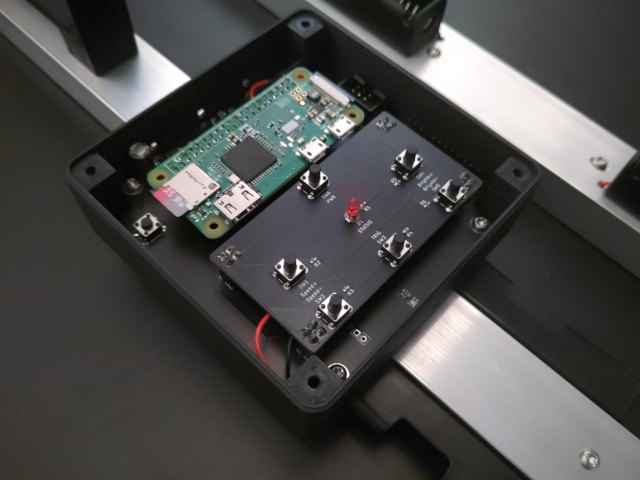
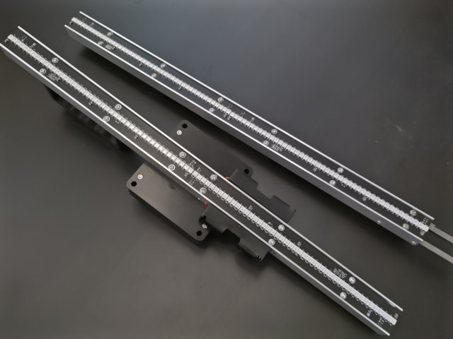
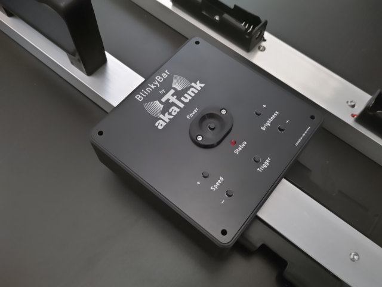
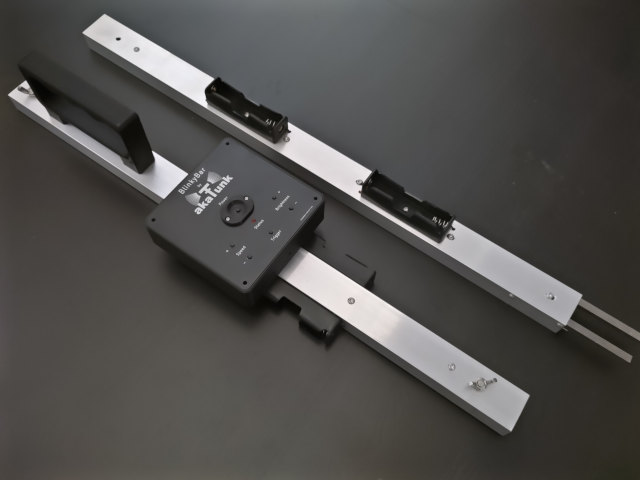

# BlinkyBar
The BlinkyBar is a modular LED light painting device based on the WS2812B programmable RGB LEDs. It features modules with a length of approximately 250mm, which can be attached to a host module of an arbitrary length. The host module holds a Raspberry Pi Zero W, which provides access to the device with a Wifi access point. A website running on the Raspi allows to upload an image. Once the trigger button on the host module is pressed, the image is played back one column after another. Combining this with a long time expose will paint the uploaded image into thin air.

We are currently working on the first release. Images made with an earlier version are shown below. This older version featured only 60 LEDs per meter, while the new one will have 180 LEDs per meter.

## Images
Examples of the old version:

3D rendering of the current main module:

Images of the first prototype:

## Building BlinkyBar

### Issues to be aware of
BlinkyBar is still in development and there are currently a few issues, which are important to note if you want to build it. They will be addressed in the future:
- The 1117 LDO is not working with the currently populated MLCC output capacitors. Their ESR is too low. You will hear an annoying high pitch tone and have a ~400 mVpp triangle on the output voltage. Either replace the output capacitors with Aluminium Electrolytic types, solder a 0.5 Ohm resistor in series with the capacitors, or use a different LDO (for example BL8071CLBTR33 or AP2114H-3.3TRG1). Currently we have tested only using the Aluminium Electrolytic caps which works fine.
- The modules are not able to power down automatically if the host module powers down. Please make sure to remove the batteries, otherwise they will be empty after some time. However, the battery under-voltage protection should work for both the host and the modules, so your batteries are safe.

### Parts
Additional part required for a BlinkyBar with 4 modules and the main unit, i.e., 10 module PCBs and a length of 2475 mm and 450 LEDs.
For the PCBs you will find lists in CSV format exported from KiCad in each of the PCBs output folder.

| Description | Count | 3D Model |
|---|---|---|
| U-Profile, 30x20x2x495 mm (WxHxTxL), Aluminum | 1 | main_profile |
| U-Profile, 30x20x2x495 mm (WxHxTxL), Aluminum | 4 | module_profile |
| 6x6x100 mm, Steel | 8 | module_bolt |
| 3D-printed stand for the module PCB | 15 | module_stand |
| 3D-printed power button protector | 1 | main_button_protector |
| 3D-printed main case | 1 | main_case |
| 3D-printed handle | 1 | main_handle |
| 18650 Holder | 12 | 18650_holder |
| Plate, 35x25x3 mm, Steel | 4 | module_plate |
| Main PCB holding the Raspberry Pi Zero and the user interface PCB | 1 | main_pcb |
| Main PCB adapter to combine and raise the two connector fro the module pcb within the main module | 1 | main_pcb_adapter |
| Main PCB front panel as the case cover | 1 | main_pcb_front |
| Main PCB user interface holding a few buttons and an LED | 1 | main_pcb_ui |
| Module PCB with the LEDs | 10 | module_pcb |
| M4x12 wing screw (DIN 316) | 4 | |
| M3x5 flat head screw (ISO7380) to hold the case to the profile | 2 | |
| M3x4 countersunk head screw (ISO 14581) to hold the battery holders | 24 | |
| M3 nut (ISO 4032) to hold the battery holders in the main case | 4 | |
| M3x8 flat head screw (ISO7380) to hold the main PCB in the case | 4 | |
| M3 nut (ISO 4032) to hold the main PCB in the case | 4 | |
| M3x20 flat head screw (ISO7380) to hold the front panel PCB to the case | 4 | |
| M3 nut (ISO 4032) to hold the front panel PCB to the case | 4 | |
| M3x12 flat head screw (ISO7380) to hold the stand to the profile | 28 | |
| M3x20 flat head screw (ISO7380) to hold the handle and two of the stands to the profile | 2 | |
| M3 nut (ISO 4032) to hold the stand to the profile | 30 | |
| M3x8 flat head screw (ISO7380) to hold the module PCB to the stand | 60 | |
| M3 nut (ISO 4032) to hold the module PCB to the stand | 60 | |
| M2x5 flat head screw (ISO7380) to hold the power button protector to the front panel PCB | 2 | |
| M2 nut (ISO 4032) to hold the power button protector to the front panel PCB | 2 | |
| M3x8 flat head screw (ISO7380) to hold the steel bolts to the profile | 16 | |

### Replacement parts
Some MPN in the CSV/schematics are just some random ones, for example for pin headers, which fit and were available at the time of design. Those may be replaced with similar types. A (bar far not complete) list of such parts is given below:

| Part | Description |Replacements |
|---|---|---|
